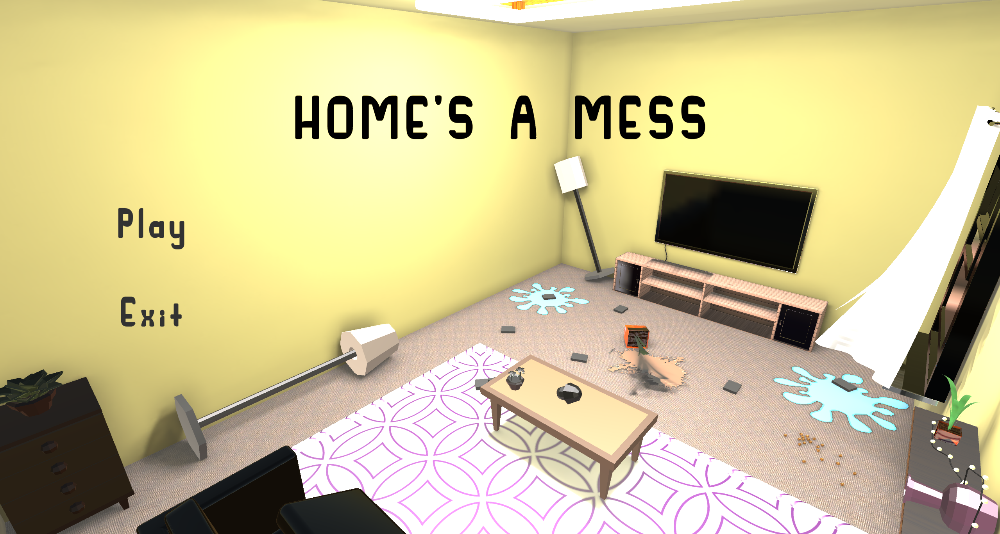
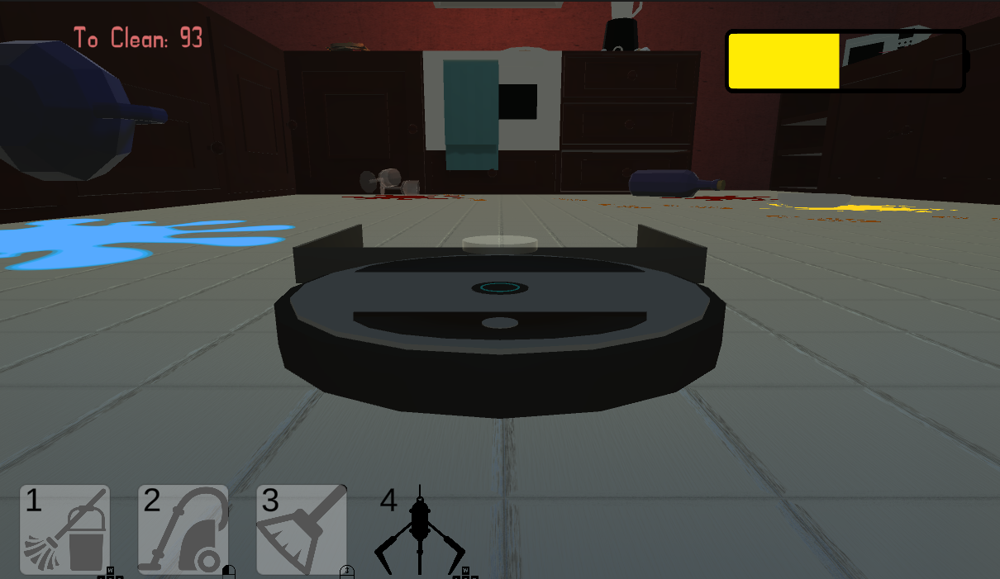

# Overview
A Gamejam with the theme "What home means to you?" You play as as Roomba in a family that consistently makes a mess. Your job is to clean up their mess. There are four modes of cleaning -- Mop, Brush, Vacuum and Claw.
# Gameplay
<iframe width="560" height="315" src="https://www.youtube.com/embed/nDcOcy9mT0A?si=YMfDJlYdZtaLS97r" title="YouTube video player" frameborder="0" allow="accelerometer; autoplay; clipboard-write; encrypted-media; gyroscope; picture-in-picture; web-share" referrerpolicy="strict-origin-when-cross-origin" allowfullscreen></iframe>

# Images

# Role
- Event-Driven Architecture: Implemented the use of event broadcasting to notify the cleaning modes change to the UI. It is also used to notify the amount of cleanable objects left to clean.
- Physics Integration: Executed physics movement through rigidbodies for the roomba movement. A ray cast was used to detect if roomba has flipped. 
- Collision Detection: Programmed a trigger script to detect cleanable objects that can only be cleaned on certain modes.

# Download Game
[Download](https://cruise-ing.itch.io/messyhome?fbclid=IwY2xjawQ8YTtleHRuA2FlbQIxMABicmlkETEyY0tHM2duRUZIMm1NZ25Vc3J0YwZhcHBfaWQQMjIyMDM5MTc4ODIwMDg5MgABHpops0wTc5cMm2uvfyUOqaRTGlF_3Wv_-SO6MjZBYm1Pcg3I3qyVrK_B6yQj_aem_8KTxXvMDjFlWhuefvfL-sQ)

# Source Code
[Home's A Mess](https://github.com/CruisinAlong/GDENG01-GameJam-Home)