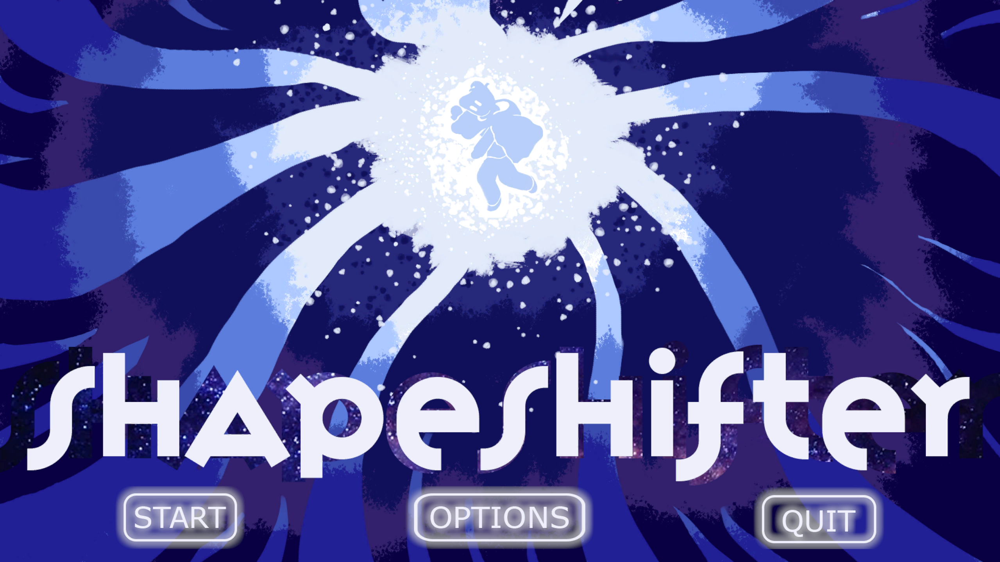
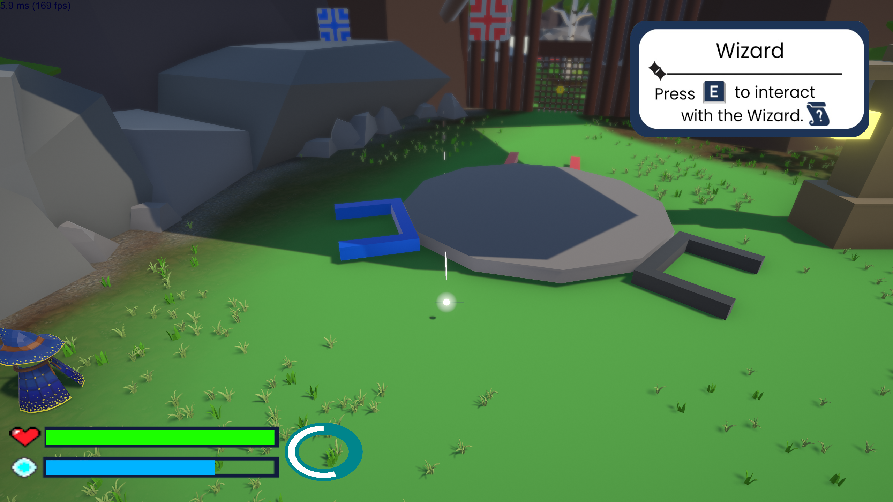
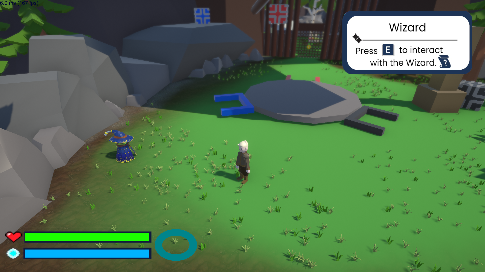

# Overview
A 9-month game project with 9 team members. This game is a 3D puzzle platformer where the player navigates the world with a special ability called shapeshift. This shapeshift ability lets the player go through geometry that it cannot pass in their original form. I entered at the 4th month of the project.

# Gameplay
<video width="100%" height = "auto" controls>
  <source src="/Mathieu022826/Files/Shapshifter.mp4" type="video/mp4">
</video>

# Images

# Role
- Lead Engineering: Spearheaded the technical development and system architecture for the whole project.
- Advanced Character Physics: Engineered a complex physics-based movement which uses momentum calculations. 
    - Recalibration of Raycast sensor to accomodate step-height ratio and layer validation for player grounded checking and walkable floors.
- Achritectural Refactoring: Transitioned the monolithic codebase into a Component-Based Architecture, improving code readability, reuseability and better debugging.
- Systems Architecture: Implemented a scalable Dialouge System and integrated dynamic UI frameworks for player feedback.
- Technical Animation & Polish: Programmerd animation logic and triggered synchonized VFX/SFX events to enhance gameplay immersion.
- Stability & QA: Led rigorous debugging and optimization to ensure polished and almost bug-free user experience
- AI Architecture: Engineered a Finite-State-Machine in Level 3 to govern complex enemy and boss behaviour including, chasing, attacking, and tracking states.

# Download Game
[Download](https://drive.google.com/drive/folders/1_XYZiRCxSJUQSQvK74yXKxJUW2Wc2MKz?fbclid=IwY2xjawQ8bahleHRuA2FlbQIxMABicmlkETEyY0tHM2duRUZIMm1NZ25Vc3J0YwZhcHBfaWQQMjIyMDM5MTc4ODIwMDg5MgABHsA85RVz1wNy5rMqR9Yels08lu__LT-eo-im1hGJ4J6eIgNwF-oWcsmZ9ZZ4_aem_k0zOD_cD0FIlPBW4SQqyFg)
# Source Code
No source code available / Repository is private